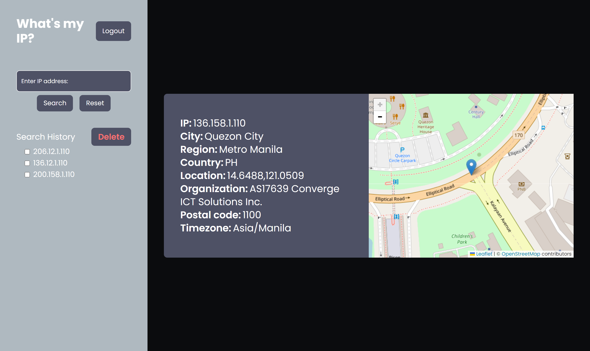

# Overview

This repository contains a sample mobile app built with React, utilizing a Node.js backend. The app includes a login screen and a home screen that displays geolocation information based on the user's IP address.



## Node Version:  20.11.0

## Project Structure

## Frontend

### Installation

1. Navigate to the `client` directory:

   ```bash
   cd client

   ```

2. Install the dependencies::

   ```bash
   npm install

   ```

3. Run the development server:

   ```bash
   npm run dev
   ```

## Backend

### Installation

1. Navigate to the `server` directory:

   ```bash
   cd server

   ```

2. Install the dependencies::

   ```bash
   npm install

   ```

3. Run the development server:

   ```bash
   npm run dev
   ```

## Features

### App

- Redirects to Login Page if not logged in, otherwise redirects to Home Screen.

## Login Screen

- Simple login form with email and password fields.
- Validates credentials against the database.
- Redirects to Home Screen upon successful login.

## Home Screen

- Displays IP & Geolocation information of the logged-in user using the provided API.
- Allows entering a new IP address to display geolocation information.
- Clears search and reverts to the logged-in user's geolocation.
- Displays a history of IP searches.
- Displays a map and pins the exact location of the specified IP address.
